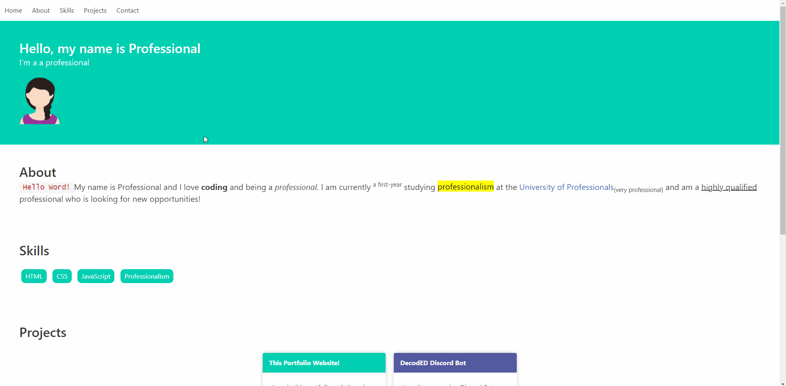

<h1 align="center">Hackiethon 2022 Workshop</h1>

> Teaching you how to build a basic portfolio website with HTML, CSS and JS (no prior experience required!)

## Demo

## About this repository
* **Workbook Guides** that detail everything we are going through in the workshop
* **Code** for the portfolio website we build during the workshop
* **Additional Code Snippets** that you could use in your Hackiethon project or get some inspo from~

## Participant Workbook Guides
1. [Setup](./docs/1-setup.md) [15min]
   * GitHub repository
   * Text Editor
2. [HTML](./docs/2-html.md) [30min]
   * Ingredients for the Web
   * HTML Page Structure
   * Anatomy of HTML Elements
   * Cheatsheet of common HTML Elements
3. [CSS](./docs/3-css.md) [30min]
   * CSS Syntax
   * Displaying and Positioning
   * Typography
4. [JavaScript](./docs/4-javascript.md) [30min]
   * Basic Syntax
   * Making a collapsible navbar
   * Modal (Libary)
5. [Deployment](./docs/5-deployment.md) [15min]
   * using GitHub Pages

## Additional Resources
* https://codepen.io/chuahxinyu/pen/KKZbgqa
* https://www.w3schools.com/
