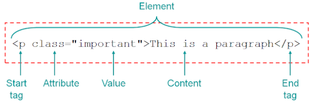

# HTML
## Ingredients for the Web
* HTML
  * Hypertext Markup Language - where all of the content / information & structure is 📝
* CSS
  * Cascading Style Sheets - makes websites look more stylish 💅
* JavaScript
  * JavaScript - allows you to implement complex features ⚙️
* CodePen Example: https://codepen.io/chuahxinyu/pen/KKZbgqa

## HTML Page Structure (Boilerplate)
```html
<!DOCTYPE html>
<html lang="en">
    <head>
        <!-- Description of the document -->
        <meta charset="UTF-8" />
        <title><!-- title goes here --> Professional Portfolio</title>
    </head>
    <body>
        <!-- your content goes here -->
        Hello World!
    </body>
</html>
```
* `<head>` contains metadata (data about data) about the webpage's properties and links to eternal related files
* `<meta />` defines metadat about a HTML document (character set, page description, keywords, author, viewport settings, etc.)
* `<link>` links currnet document to external resources (usually used to linke to stylesheets or js files)
* `<title>`

## Anatomy of HTML Elements


## Cheatsheet of Common HTML Elements
* Resource: [W3Schools - HTML](https://www.w3schools.com/html/default.asp)
### Basic
* `<!-- comment -->` comment
* `<h1>` - Heading 1 (hargest heading)
* `<p>` - Paragraph

### Text Formatting
* `<pre>` - Preformatted text (preserves text spaces, line breaks and tabs etc.)
* `<code>` - Code
* `<b>` - Bold text
* `<i>` - Italicised text
* `<u>` - Underlined text
* `<mark>` - Marked/Highlighted text
* `<sub>` - Subscript text
* `<sup>` - Superscript text

### Links and Images
* `` - Image
  * source can be from local file/folder or a server/website
  * other common attributes: `alt="..." width="...px" height="...px"`
* `<a href="...">` - Link

### Lists
* `<ul>` - Unordered List
* `<ol>` - Ordered List
* `<li>` - List Item

### Tables
* `<table>` - Table
* `<tr>` - Table Row
* `<th>` - Table Header
* `<td>` - Table Data

### Forms
* `<form>` - Form
* `<input>` - Input element
  * `type=".."` can be `text`, `radio`, `checkbox`, `submit` or `button`
* `<label>` - Label for form element
* `<button>` - Button
  * `type="submit"`
* https://formspree.io/
  1. Create and account and verify it
  2. Create a new form and follow the instructions

